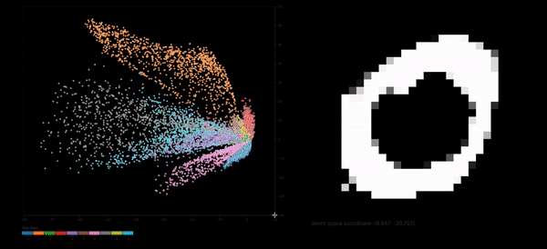

# Autoencoder latent space visualization

This project first creates the autoencoder model in tensorflow python,
then exports the models to be used to visualize the 2D latent space that we reduced down to. The visualization takes in the latent space coordinate
into the decoder and displays the output mnist digit.



## Client

The main controller of logic is located in `client/src/App.svelte`

### Get started Developing

```bash
cd client
npm install
npm run dev
```

## Preprocess

`mnist-to-json.ipynb` converts the mnist images to flattened and into json to be used within the client.

`autoencoder.ipynb` creates the autoencoder, then exports the encoder and decoder to the client.

All files from the exports will be directed at `client/public/datafiles` such that they can be used from the svelte client.
